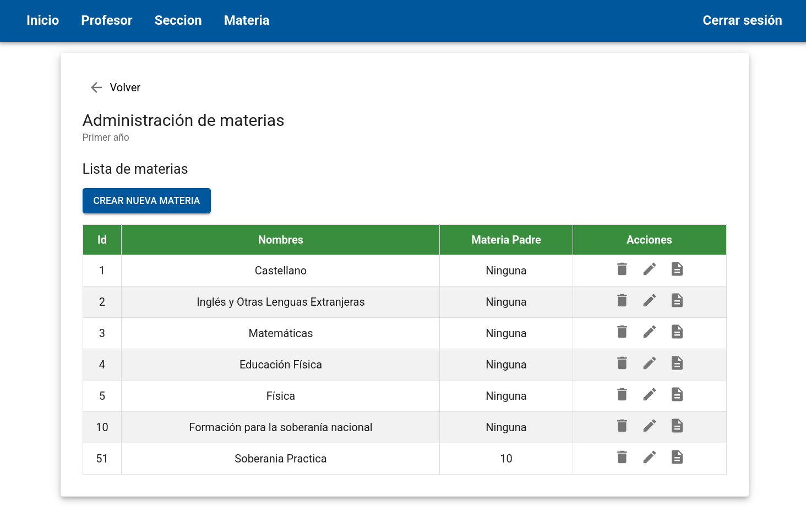
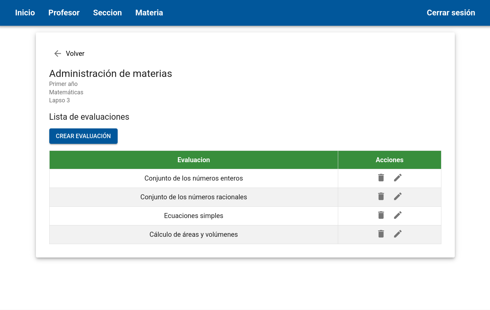
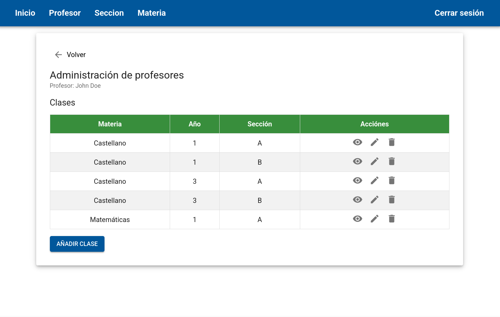
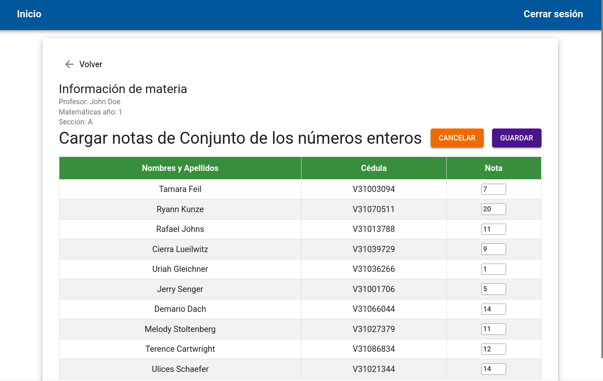

# Front-End-Servicio

This repository contains the frontend source code of an Academic Management System made for a real school and not implemented (a service community project). It was built using React, Material UI, and Redux Toolkit. The application provides a comprehensive interface for academic administration, allowing system administrators to manage the entire structure, and professors to manage their assigned class records and evaluations.

1. [Technology Stack](#technology-stack)
2. [System Architecture](#system-architecture)
3. [User Roles & Access](#user-roles--access)
4. [Core Module Functionality](#core-module-functionality)
6. [Screenshots](#screenshots)
7. [Installation](#installation)

## Technology Stack

*   **Frontend Framework:** React
*   **UI Library:** Material UI (MUI)
*   **State Management:** Redux Toolkit
*   **Build Tool:** Vite.js
*   **Data Layer:** Axios (for API communication) & Knex (for database interaction)

## System Architecture

The application follows a clear separation of concerns between the different layers:

*  **Presentation:** The `src/components/` directory contains all React components built with MUI, handling UI rendering and user interaction.
*   **Routing:** Defined in `src/routes/index.tsx`, organizing the application into public views and restricted administrative areas.
*   **API:** All data interaction is handled through the `src/api/` directory, which defines specific endpoints for CRUD operations on Sections, Professors, Subjects, and Evaluations.
*   **State Management (Redux):** State is centralized in `src/store/index.js` and divided into feature-specific slices:
    *   `secciones.js`: Manages section and academic year data.
    *   `profesorClases.js`: Manages professor and class relationships.
    *   `materias.js`: Manages all subject/course definitions.
    *   `evaluaciones.js`: Manages all grade and evaluation records.

## User Roles & Access

The system operates based on defined roles, dictating access to specific features:

*   **Administrator (Admin):** Responsible for system-level configuration. Can create/manage users, academic years, classes, sections, and subjects.
*   **Professor:** Restricted to managing the data pertaining to the classes they are assigned to, including viewing and managing grades for their students.

Students do not have a defined role; instead, they are the main entity whose records (grades, section assignments) are managed by the Admin and Professor roles.

## Core Module Functionality

| Module | Core Purpose | Key Data Managed | Access Level |
| :--- | :--- | :--- | :--- |
| **Administration** | System configuration and user management. | Accounts, Academic Years, Roles. | Admin Only |
| **Class/Section** | Defining the organizational structure. Managing records. | Classes, Sections, Academic Years, Records. | Admin |
| **Subjects** | Defining the educational content. | Subjects/Courses. | Admin, Professor |
| **Performance Tracking** | Recording and managing student performance. | Grades, Evaluations, Report Cards. | Admin, Professor |

## Screenshots
<details>
<summary><b>Admin UI</b></summary>

<br>

| Subjects | Subjects Evaluations | Professor Asignments |
|:---:|:---:|:---:|
|  |  |  |

</details>

<br>

<details>
<summary><b>Professor UI</b></summary>

<br>

| Home | Grade Assignment |
|:---:|:---:|
|  |  |

</details>

## Installation
1. Clone the repository.
2. Navigate to the project directory.
3. Install dependencies:
   ```bash
   npm install
   ```
4. Configure the .env file (project created backend is private so probably not feasible without access to it).

To start the development server:
```bash
npm run dev
```
